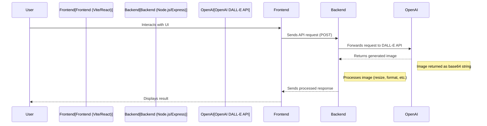

# System Architecture Scheme

## Connection Details:
1. **Frontend**:
   - Built with Vite + React
   - Makes API calls to backend using fetch()
   
2. **Backend**:
   - Node.js + Express server
   - Handles CORS for frontend access
   - Processes requests and communicates with OpenAI API
   
3. **API Communication**:
   - Frontend sends POST requests to backend endpoints
   - Backend forwards requests to OpenAI DALL-E API
   - Responses flow back through backend to frontend
