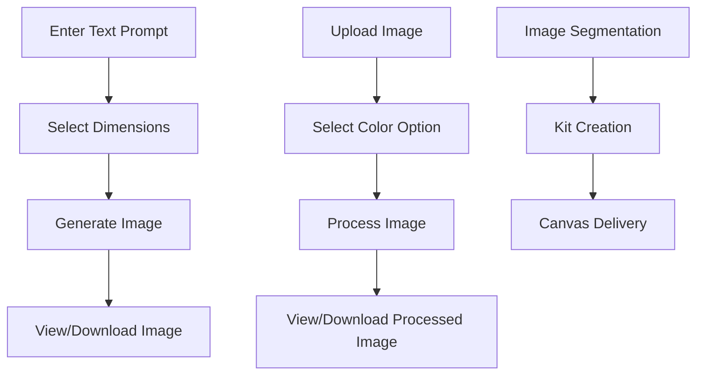

# User Flow Documentation



## 1. Image Generation Flow
1. User enters text prompt in input field
2. User selects image dimensions from dropdown
3. User clicks "Generate Image" button
4. System displays generated image
5. User can download generated image

## 2. Image Processing Flow
1. User uploads image or uses generated image
2. User selects color option (12 colors, 24 colors, or vector)
3. User clicks "Segment" button
4. System processes image based on selected option
5. User views processed image
6. User can download processed image

## 3. Service Flow (Gentext)
1. Image Segmentation Request
   - User uploads image
   - System segments image into paint-by-numbers sections
2. Painting Kit Creation
   - System creates physical paint-by-numbers kit
3. Canvas Delivery
   - System delivers prepared canvas to user
4. Color Palette Customization
   - User can customize color palette
5. Bulk Orders
   - Businesses can order multiple kits

## Error Handling
- Invalid file type upload
- Missing required fields
- Image generation/processing failures
- Network errors

## Backend-Frontend Connection

The Node.js/Express backend connects with the Vite/React frontend through:

1. **CORS Configuration**:
```javascript
const corsOptions = {
    origin: 'http://localhost:5173', // Vite dev server
    methods: ['GET', 'POST'],
    allowedHeaders: ['Content-Type'],
};
app.use(cors(corsOptions));
```

2. **API Endpoints**:
- POST /generateImage: Handles image generation requests
- POST /segmentImage: Handles image segmentation requests

3. **Frontend API Calls**:
```javascript
// Example API call from React component
const response = await fetch("http://localhost:4000/generateImage", {
    method: "POST",
    headers: {
        "Content-Type": "application/json",
    },
    body: JSON.stringify({ prompt, height, width }),
});
```

4. **Development Setup**:
- Backend runs on port 4000
- Frontend runs on port 5173 (Vite default)
- CORS allows frontend to access backend APIs

## Components Involved
- ImageGenerate.jsx: Handles image generation and processing UI
- server.js: Handles image generation and processing backend
- Gentext.jsx: Provides service descriptions
